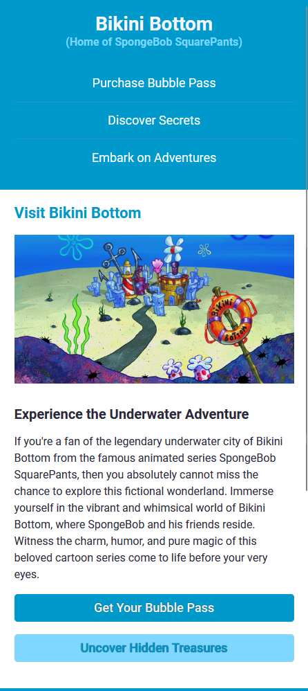

# Bikini Bottom

This project demonstrates the use of responsive CSS. It is based on a tourist location for Bikini Bottom. The project does not have any functionality, only CSS.

## Preview

## Usage

To run the project, use a live server or an extension in Visual Studio Code such as Live Server.
